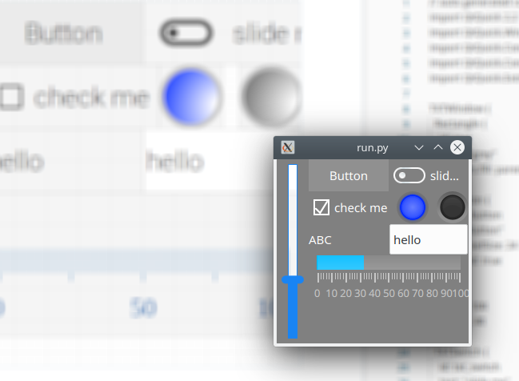
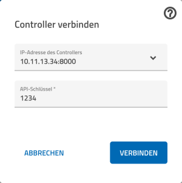

# SofTXT

Simple pure software implementation of the upcoming fischertechnik
TXT-4.0 controller [Video](https://youtu.be/1ub4-ASsy-U).

These scripts implement the online behaviour of the TXT-4.0 and can be
run as a client against [ROBO Pro
Coding](https://docs.fischertechnik-cloud.com/books/robo-pro-coding)
available e.g. for
[Android](https://play.google.com/store/apps/details?id=eu.beemo.roboprocoding).



Optionally and for physical fischertechnik inputs and outputs a
ftDuino is supported.

## Howto

You'll need

- A device running RoboPro Coding
  - tested with Android RoboPro Coding 6.0.4
- A linux PC running SofTXT (this project)
  - Optionally connected via USB to a [ftDuino](http://ftduino.de) running the [IoServer sketch](https://github.com/harbaum/ftduino/tree/master/ftduino/libraries/WebUSB/examples/IoServer)

On the Linux PC you'll need the following packages (e.g. install them using apt-get):

- python3
- python3-pyqt5
- python3-pyqt5.qtquick
- qml-module-qtquick-extras

To use SofTXT simply clone this repository and run
```txt-4.0.py```. This will start a web server that listens on port
8000 and provides the web API that ROBO Pro Coding expects to see. The
server will store downloaded programs in the local ```workspaces```
directory and run the ```run.py``` script whenever an app is supposed
to run. ```run.py``` and all other files are needed to execute
downloaded programs.

In order to access the SoftXT from RoboPro Coding enter ```<your linux
ip>:8000``` as the IP address into the "Controller verbinden" dialog
of ROBO Pro Coding. Replace <your linux ip> with the IP address of the
Linux PC running SofTXT displayed by ```txt-4.0.py``` as shown below:

```
$ ./txt-4.0.py
Starting TXT-4.0 server on http://10.11.13.34:8000
```

You can give anything for ```API-Schlüssel``` as this is not verified
by SofTXT.


